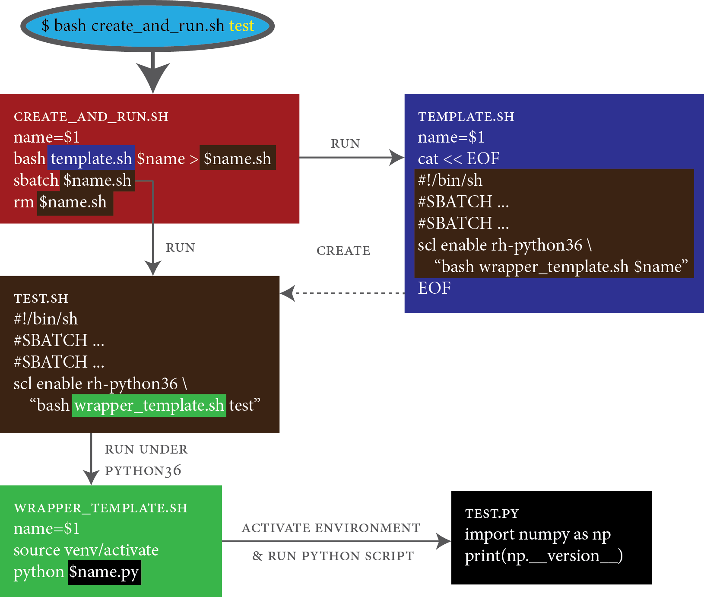

# Slurm - A Quick Solution for Python with Virtual Envs



This is a quick solution for running `sbatch` on Python scripts that are assumed to run on virtual environments.

## Instructions

1. If not done yet, create your Python virtual environment at `/path/to/env/`, where it should have a file `/path/to/env/bin/activate` file
1. Make sure that you have the following scripts on the same directory of your Python script
1. Edit `template.sh` to ensure your `#SBATCH` options are custom to you
1. Edit your `wrapper_template.sh` script such that it sources the `activate` file in your environment location
    - E.g. `source /path/to/env/bin/activate`
1. (Optional) The `create_and_run.sh` script is set to remove the sbatch script (`rm $name.sh`). If you do not wish to remove it after releasing the submitting the job, comment that line
1. Run the `create_and_rush.sh` with the name (without extension) of the Python file as an argument. It only takes a single argument and uses it to create shell script and runs it 

```shell
$ bash create_and_run.sh test # to run test.py
```

You may also write a function and write it on your `~/.bashrc` (or `~/.zshrc`, or whatever shell you use) file 

```shell
# ~/.bashrc
function create_and_run(){
    bash template.sh $1 > $1.sh
    sbatch $1.sh
}
```

And (after sourcing your `~/.bashrc`), you may simply run
```shell
$ create_and_run test
```